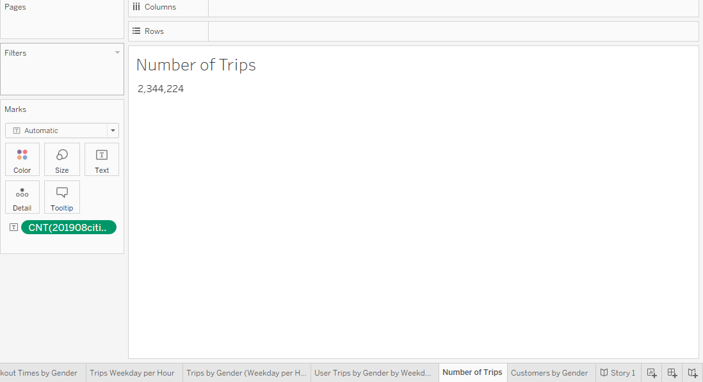
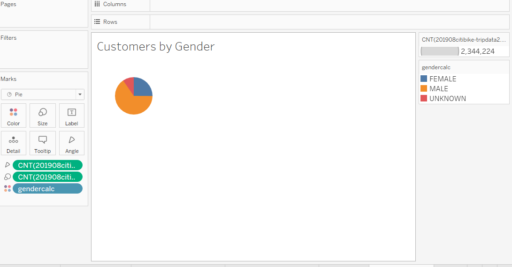
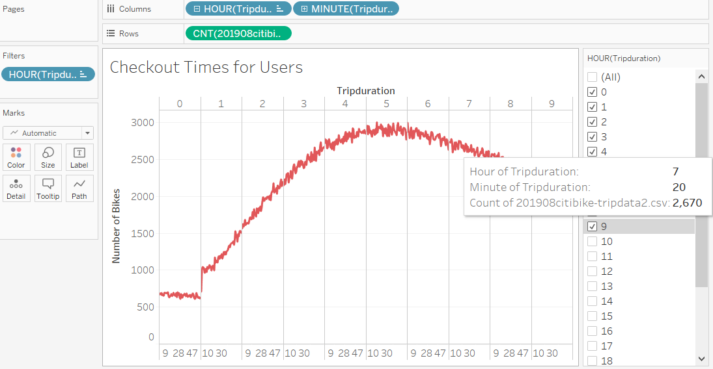
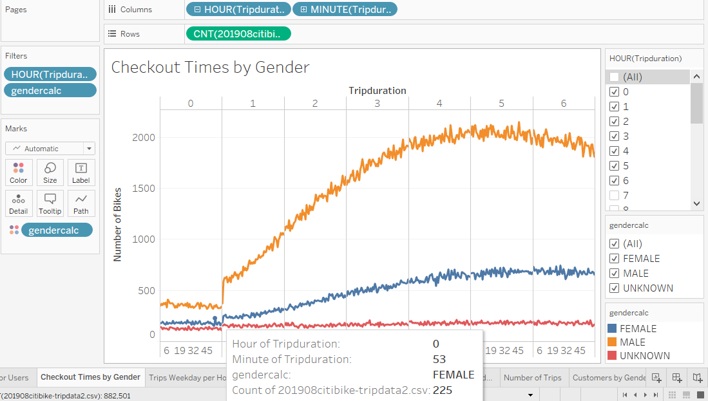
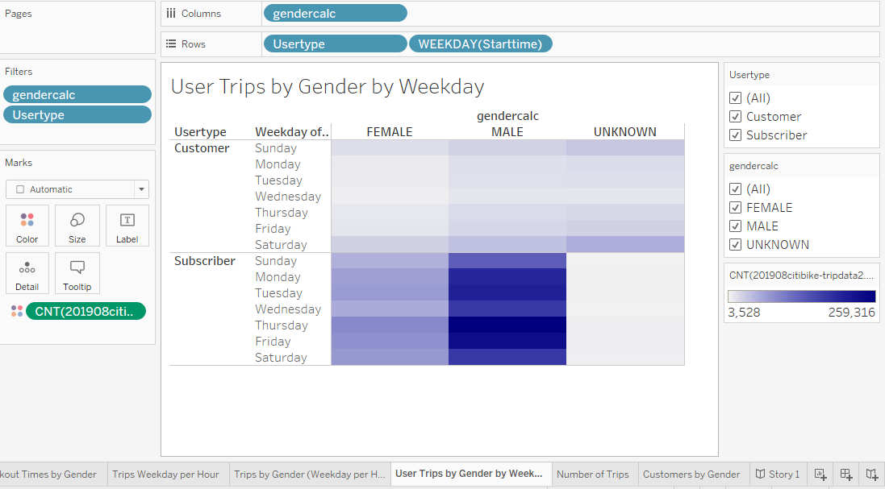
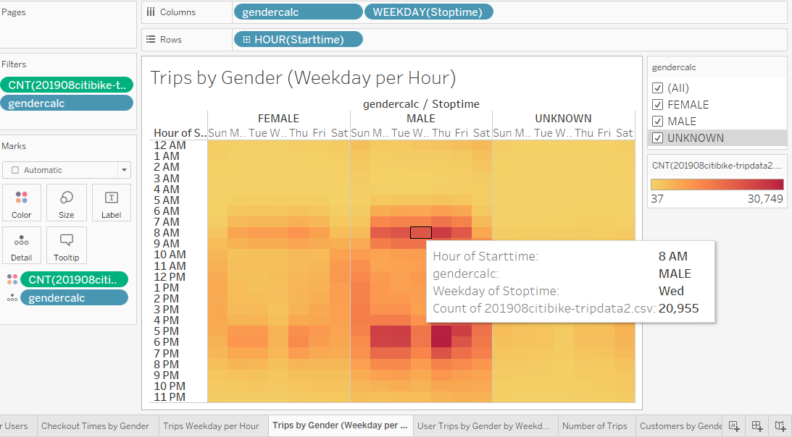
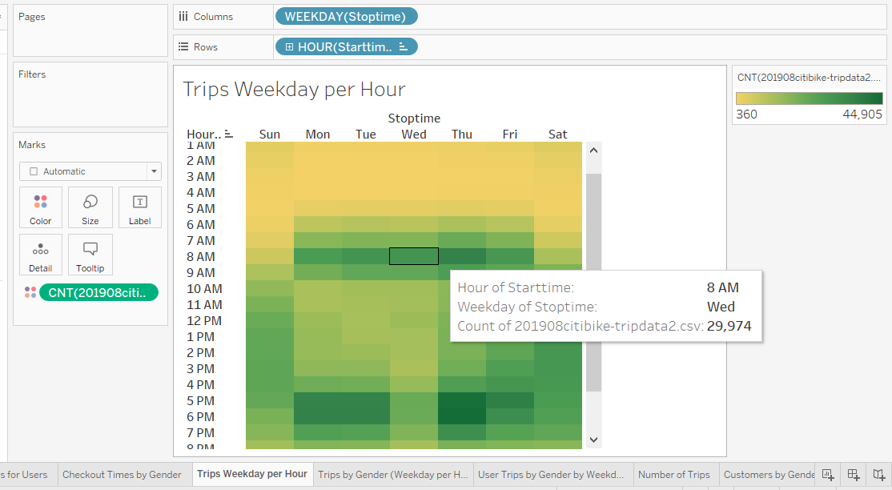

# Tableau_Citibike

## Overview of the Analysis

The purpose of this analysis is to use Tableau to present a business proposal for a bike-sharing company. The analysis was 
conducted by using data from the "Citibike" bike sharing service. I used trip data from August 2019, a month of the year 
that is popular for outdoor activities such as biking. The analysis encompasses information such as trip duration, starting 
and ending points, number of users, number of subscribers, gender and age of riders. This analysis will provide a proportional
comparison to convince investors that a bike sharing program in Des Moines is lucrative. 

## Results 

### Total Trips 

### Customer breakdown 

### The length of time that bikes are checked out for all riders.

### The number of bike trips by weekday for each hour of the day as a heatmap.

### The length of time that bikes are checked out for each gender.

### The number of bike trips by gender for each hour for each day of the week as a heatmap.

### The number of bike trips for each hour of each day of the week as a heatmap.

## Summary 

